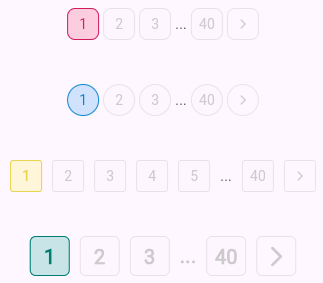
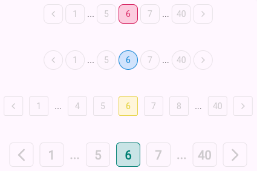
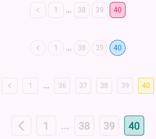

 
# Material Pagination

<!-- [](https://pub.dev/packages/material_pagination)
[](https://github.com/your_username/material_pagination/actions) -->


MaterialPagination is a customizable and flexible pagination widget for Flutter applications. It allows you to easily create pagination controls with numbered page buttons, next/previous arrows, and extensive customization options.


## Screenshots

<div align="center"> 
<table>
  <td>
   
  </td> 
  <td>
   
  </td>
  <td>
   
  </td>
  
  
</table>
</div>


## Features

- Customizable page buttons, including their size, style, and color.
- Previous and Next navigation arrows.
- Supports any number of pages with a configurable visible page range.
- Darken effect for the active page.
- Callback for page changes.
- Flexibility to adapt to various designs and themes.

## Installation

Add the following to your `pubspec.yaml`:

```yaml
dependencies:
  material_pagination: ^1.0.0
```

Then, run:

```bash
flutter pub get
```

## Usage

### Basic Example

```dart
import 'package:flutter/material.dart';
import 'package:material_pagination/material_pagination.dart';

class PaginationExample extends StatelessWidget {
  @override
  Widget build(BuildContext context) {
    return Scaffold(
      appBar: AppBar(title: Text('Pagination Example')),
      body: Center(
        child: MaterialPagination(
          currentPage: 1,
          totalPages: 10,
          onPageChanged: (page) {
            print('Page $page selected');
          },
          visiblePageCount: 5,
          activeColor: Colors.blue,
          inactiveColor: Colors.grey,
          fontStyle: TextStyle(fontSize: 16, fontWeight: FontWeight.bold),
        ),
      ),
    );
  }
}
```

## Parameters

| Parameter                   | Type                     | Description                                                                                             | Default         |
| ----------------------------| ------------------------ | ------------------------------------------------------------------------------------------------------- | --------------- |
| `currentPage`                | `int`                    | The current active page number.                                                                         | `1`             |
| `totalPages`                 | `int`                    | The total number of pages available.                                                                    | Required        |
| `onPageChanged`              | `Function(int page)`     | Callback when a page number or next/previous arrow is pressed.                                           | Required        |
| `visiblePageCount`           | `int`                    | Number of page buttons visible at one time.                                                             | `5`             |
| `activeColor`                | `Color`                  | The color of the active (selected) page button.                                                         | `Colors.blue`   |
| `inactiveColor`              | `Color`                  | The color of the inactive (non-selected) page buttons.                                                   | `Colors.grey`   |
| `fontStyle`                  | `TextStyle?`             | The text style for the page numbers.                                                                    | Default         |
| `buttonSize`                 | `double`                 | The size of each page number button.                                                                     | `32.0`          |
| `iconSize`                   | `double`                 | The size of the arrow icons.                                                                             | `12.0`          |
| `iconGap`                    | `double`                 | The gap between page buttons and next/previous icons.                                                    | `4.0`           |
| `borderRadius`               | `double`                 | The border radius for the page number buttons and icons.                                                 | `8.0`           |
| `colorDarkness`              | `double`                 | Value between 0 and 1 to adjust the darkness of the active page's button border.                         | `0.3`           |

## Advanced Example

```dart
MaterialPagination(
  currentPage: 3,
  totalPages: 15,
  onPageChanged: (page) {
    setState(() {
      _currentPage = page;
    });
  },
  visiblePageCount: 7,
  activeColor: Colors.green,
  inactiveColor: Colors.grey,
  fontStyle: TextStyle(fontSize: 14, fontWeight: FontWeight.w500),
  buttonSize: 40.0,
  borderRadius: 10.0,
)
```

## Customization

### Custom Button Style

You can fully customize the appearance of the page buttons by modifying the `fontStyle`, `activeColor`, `inactiveColor`, and other related properties. 

```dart
MaterialPagination(
  currentPage: 1,
  totalPages: 20,
  onPageChanged: (page) {
    print('Page $page selected');
  },
  fontStyle: TextStyle(fontSize: 14, fontWeight: FontWeight.w600, color: Colors.white),
  activeColor: Colors.orange,
  inactiveColor: Colors.black,
  buttonSize: 30.0,
)
```

### Next/Previous Buttons

This widget also supports next and previous arrow buttons to easily navigate between pages.

```dart
MaterialPagination(
  currentPage: 5,
  totalPages: 50,
  onPageChanged: (page) {
    print('Page $page selected');
  },
  iconSize: 16.0,
  iconGap: 8.0,
)
```

## Running Tests

You can run tests by using the Flutter testing framework:

```bash
flutter test
```

## Contributing

Contributions are welcome! Feel free to open an issue or submit a pull request.

## License

This project is licensed under the MIT License. See the [LICENSE](./LICENSE) file for details.
